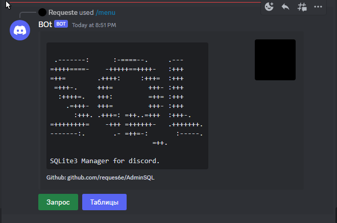
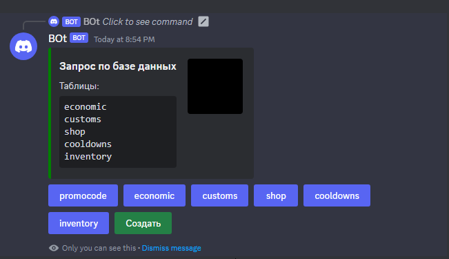
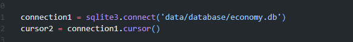

# AdminSQL
Управление базой данных с помощью дискорд бота

# Как настроить бота?
Заходим в cogs/AdminSQL.py и находим такую строчку:

Замените "data/database/economy.db" на путь к своему db.

# Какую версию Python и библиотеки стоит использовать?
Код проверялся на версии Python 3.9.9 и на библиотеке nextcord 2.6.0
